# 2. Secure RAG Application

Retrieval-augmented generation answers questions using external documents — and creates a web of
trust boundaries between users, prompts, retrieved content, embeddings, data stores and the model.
Every boundary is an attack surface.

## Business Scenario

A small RAG assistant over fictional company documents for "Northwind Retail," with two user roles
with different entitlements: a general employee and an HR user. Real moving parts: a document
ingestion pipeline, an embedding step, and a vector database.

## Architecture & Trust Boundaries

```mermaid
flowchart TB
    subgraph Untrusted["Untrusted zone"]
        Emp([Employee User])
        HR([HR User])
        Docs[/Ingested Documents\nincl. possibly poisoned/]
    end

    subgraph App["RAG Application"]
        Auth[AuthN/AuthZ\nrole check]
        Query[Query Handler]
        Retriever[Retriever]
        PromptBuilder[Prompt Builder\nseparates instructions\nfrom retrieved data]
        Ingest[Ingestion Pipeline]
        Embed[Embedding Step]
    end

    subgraph Data["Data Stores"]
        VDB[(Vector DB\ne.g. Chroma)]
    end

    Model[(LLM)]

    Emp -->|query| Auth
    HR -->|query| Auth
    Auth -->|authorized query| Query
    Query --> Retriever
    Retriever -->|tenant/role-filtered search| VDB
    VDB -->|top-k chunks| Retriever
    Retriever --> PromptBuilder
    PromptBuilder -->|prompt + labeled\nretrieved context| Model
    Model -->|response| Query
    Query -->|response, output-validated| Emp
    Query -->|response, output-validated| HR

    Docs -->|ingest| Ingest
    Ingest --> Embed
    Embed -->|vectors| VDB

    style Untrusted fill:#3a1414,stroke:#c0392b
    style Data fill:#14243a,stroke:#2980b9
```

**Trust boundaries marked above:** (1) user → app at `Auth`, where role is decided; (2) document →
ingestion pipeline, where untrusted content enters; (3) retriever → vector DB, where tenant/role
filtering must be enforced; (4) model output → user, where output validation happens.

## Attack Catalogue

- **Indirect prompt injection** — malicious instructions embedded inside a retrieved document,
  testing whether they override the app's own rules. The defining RAG vulnerability: the payload
  arrives through data, not through the user.
- **Cross-tenant leakage** — can the employee role retrieve HR-only documents through cleverly
  worded queries, exposing weak retrieval filtering or missing access control?
- **Data poisoning** — ingest a document containing false/adversarial instructions and observe how
  it corrupts later answers.
- **Context exfiltration** — attempt to make the model reveal restricted retrieved context or
  documents the current user should not see.
- **Embedding weaknesses** — probe whether crafted inputs surface unintended neighbours from the
  vector store.

## Findings Mapping (OWASP Top 10 for LLM Applications)

| Attack | OWASP LLM Category |
|---|---|
| Indirect prompt injection | LLM01 — Prompt Injection |
| Cross-tenant leakage / context exfiltration | LLM02 — Sensitive Information Disclosure |
| Embedding weaknesses / data poisoning | LLM08 — Vector and Embedding Weaknesses |

Also map adversary tactics to [MITRE ATLAS](https://atlas.mitre.org/).

## Mitigations

- Document trust labels — treat all retrieved content as untrusted by default
- Retrieval filtering and query-time access control (role/tenant scoped)
- Strict tenant isolation in the vector store
- Output validation before returning model responses
- Separate retrieved data from instructions in the prompt (structural, not just textual, separation)

Show the full loop per finding: vulnerable behaviour → mitigation → retest → residual risk.

## Portfolio Checklist

- [ ] RAG app code (ingestion, embedding, retrieval, generation) in `app/`
- [ ] Data-flow diagram (above) with trust boundaries explicitly marked
- [ ] Two test roles with different document access, demonstrated
- [ ] Attack scripts/queries for each catalogue item, with before/after evidence
- [ ] Findings mapped to LLM01 / LLM02 / LLM08 and MITRE ATLAS
- [ ] Written report + short demo + one-page executive summary

## Tools & References

| Tool / Standard | Link |
|---|---|
| LangChain | https://python.langchain.com/ |
| LlamaIndex | https://www.llamaindex.ai/ |
| Chroma (vector DB) | https://www.trychroma.com/ |
| Ollama | https://ollama.com/ |
| OWASP Top 10 for LLM Applications | https://owasp.org/www-project-top-10-for-large-language-model-applications/ |
| MITRE ATLAS | https://atlas.mitre.org/ |
