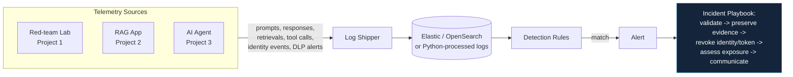

# 4. AI Security Monitoring and Detection Lab

Most AI-security portfolios focus entirely on prevention. Models get deployed, attacks get
through — this project is detection and response, where existing SOC-analyst instincts transfer
directly, over searchable logs, no ML research required.

## Business Scenario

Telemetry generated by the systems built in [Project 1](../01-ai-red-teaming-lab/README.md),
[Project 2](../02-secure-rag-application/README.md) and [Project 3](../03-secure-ai-agent/README.md):
prompts, model responses, document retrievals, tool calls, identity events, blocked actions and
DLP alerts.

## Architecture

## Detections to Engineer

- Repeated jailbreak or injection attempts from one user/session
- Secrets or credentials submitted in prompts (shadow-AI data-leak path)
- Anomalous retrieval volumes suggesting scraping or exfiltration
- Unexpected or denied tool calls, and tool calls outside an agent's normal pattern
- Access to a new or unusual data source
- Abnormal agent behaviour, e.g. unplanned multi-step actions
- Possible exfiltration through model output (sensitive data leaving via the response itself)

Each detection is documented with the triggering log event and tuned to reduce false positives —
the tuning is the actual craft, not just writing the rule.

## Incident Playbook (one scenario, end to end)

1. Validate the alert
2. Preserve evidence
3. Revoke the offending identity or token
4. Assess what data was exposed
5. Communicate the impact

This mirrors real operational roles that span shadow-AI discovery, rogue-agent investigation, DLP
monitoring, developer-AI governance, logging, and translating telemetry into actionable findings.

## Portfolio Checklist

- [ ] Log shipper / ingestion script feeding telemetry from Projects 1–3
- [ ] Each of the 7 detections above, implemented as a query/rule
- [ ] False-positive tuning notes per detection
- [ ] One full incident playbook, walked end to end with sample data
- [ ] Written report + short demo + one-page executive summary

## Tools & References

| Tool / Standard | Link |
|---|---|
| Elastic | https://www.elastic.co/ |
| OpenSearch | https://opensearch.org/ |
| OWASP Top 10 for LLM Applications | https://owasp.org/www-project-top-10-for-large-language-model-applications/ |
| MITRE ATLAS | https://atlas.mitre.org/ |
