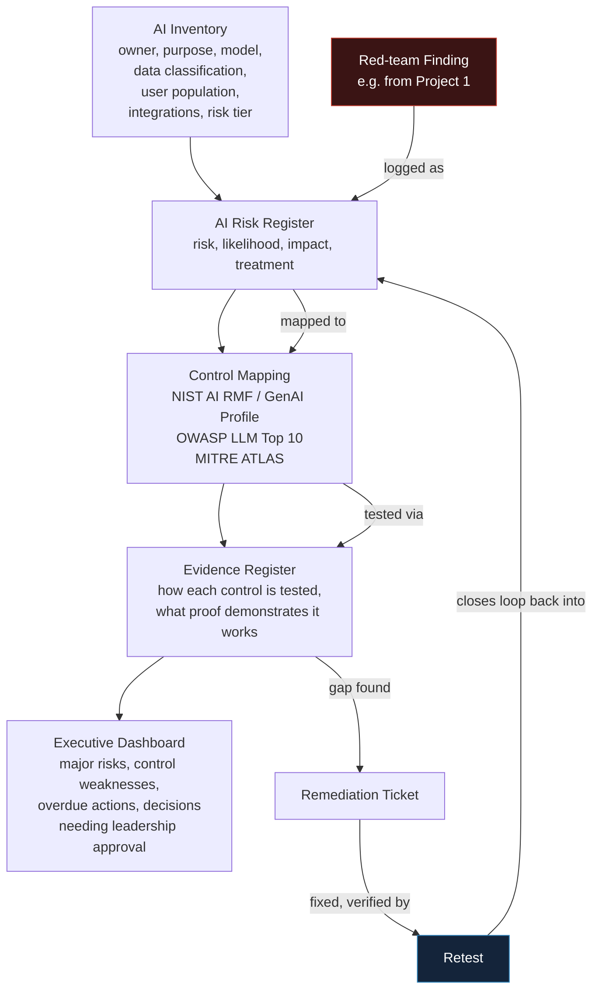

# 5. AI Security and Governance Assurance System

Connects technical security work to business decisions — the skill that separates senior candidates
from junior ones, and the one most technically-minded applicants neglect entirely.

## Business Scenario

A fictional organisation, "Northwind Retail," running several AI systems: an employee chatbot, a
customer-support assistant, a coding agent and a decision-support model.

## Architecture

## Components

- **AI Inventory** — every system's owner, purpose, model, data classification, user population,
  integrations and risk tier. "We don't even know how many AI systems we run" is a real, common
  failure.
- **AI Risk Register** — each risk, its likelihood and impact, and its treatment
- **Control Mapping** — controls aligned to the [NIST AI RMF](https://www.nist.gov/itl/ai-risk-management-framework),
  the NIST Generative AI Profile (NIST AI 600-1), the
  [OWASP LLM Top 10](https://owasp.org/www-project-top-10-for-large-language-model-applications/)
  and relevant [MITRE ATLAS](https://atlas.mitre.org/) techniques
- **Evidence Register** — exactly how each control is tested and what proof demonstrates it's working
- **Executive Dashboard** — major risks, control weaknesses, overdue actions, decisions needing
  leadership approval

## The Traceability Thread

Take one real red-team finding from [Project 1](../01-ai-red-teaming-lab/README.md) and follow it
all the way through: demonstrated attack → logged risk → mapped control → evidence requirement →
remediation ticket → retest. That single thread — a technical weakness becoming a managed business
risk — is the detail that elevates this project above a stack of spreadsheets, and it's the
strongest single artefact in the whole portfolio.

## Portfolio Checklist

- [ ] AI inventory covering all 4 fictional systems
- [ ] Risk register with at least the finding(s) traced from Project 1
- [ ] Control mapping table (control ↔ NIST AI RMF ↔ OWASP LLM Top 10 ↔ MITRE ATLAS)
- [ ] Evidence register entries for each mapped control
- [ ] Executive dashboard (even a simple one) summarising risk posture
- [ ] The full traceability thread, documented end to end
- [ ] Written report + short demo + one-page executive summary

## Tools & References

| Standard | Link |
|---|---|
| NIST AI Risk Management Framework (AI RMF 1.0) | https://www.nist.gov/itl/ai-risk-management-framework |
| NIST Generative AI Profile (NIST AI 600-1) | https://www.nist.gov/itl/ai-risk-management-framework |
| OWASP Top 10 for LLM Applications | https://owasp.org/www-project-top-10-for-large-language-model-applications/ |
| MITRE ATLAS | https://atlas.mitre.org/ |
